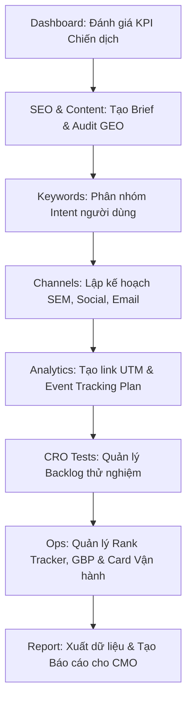

# Kịch Bản & Hướng Dẫn Sử Dụng Chi Tiết: Digital Marketing Workbench
## Bối Cảnh Doanh Nghiệp: VinaGlow Corp (Chuỗi Bán Lẻ Mỹ Phẩm & Chăm Sóc Sức Khỏe)

---

### 1. Giới thiệu Bối Cảnh & Vai Trò của Bạn

* **Công ty:** **VinaGlow Corp** – Tập đoàn bán lẻ mỹ phẩm cao cấp với chuỗi **120 cửa hàng vật lý** toàn quốc và nền tảng thương mại điện tử (E-commerce website) đạt hơn 2 triệu traffic/tháng.
* **Vai trò của bạn:** **Senior Digital Marketing & SEO Executive**. 
* **Nhiệm vụ của bạn:** Chịu trách nhiệm quản lý, tối ưu hóa toàn bộ các hoạt động Digital Marketing cho dòng sản phẩm chiến lược mới: **"Serum Trị Mụn BHA 2% VinaGlow"**. Bạn cần phối hợp giữa Technical SEO, Content AI, Quảng cáo đa kênh (SEM, Meta, Email), theo dõi Analytics, chạy thử nghiệm CRO (tối ưu tỷ lệ chuyển đổi) và quản lý hoạt động Local SEO của các chi nhánh lớn.
* **Mục tiêu cuối tuần:** Hoàn thành báo cáo hiệu suất tuần gửi cho **CMO (Chief Marketing Officer)** để đưa ra các hành động khắc phục lỗi vận hành và đề xuất tăng ngân sách quảng cáo.

Công cụ **Digital Marketing Workbench** sẽ là "trợ thủ đắc lực" giúp bạn thực thi toàn bộ luồng công việc này một cách khoa học. Dưới đây là hướng dẫn thao tác từng bước theo kịch bản thực tế.

---

### 2. Các Bước Thao Tác Chi Tiết Trong Kịch Bản



---

### BƯỚC 1: Đánh Giá Hiệu Suất Chiến Dịch Tuần Qua (Dashboard & KPI Snapshot)
*Bạn cần cập nhật số liệu quảng cáo của tuần vừa rồi để xem dòng Serum BHA có đạt mục tiêu lợi nhuận hay không.*

1. **Thao tác:**
   * Truy cập Tab **Dashboard**.
   * Di chuyển đến phần **Campaign Performance**.
   * Nhập các số liệu thực tế từ Google Ads và Google Analytics 4 (GA4) của tuần qua:
     * **Impressions (Số lượt hiển thị):** `150000` (150 nghìn lượt)
     * **Clicks (Số lượt nhấp):** `4500` (4.5 nghìn click)
     * **Leads (Số lead hoàn thành điền form tư vấn):** `180`
     * **Spend (VND - Ngân sách chi tiêu):** `15000000` (15 triệu VND)
     * **Revenue (VND - Doanh thu mang lại):** `75000000` (75 triệu VND)
   * Nhấp nút **Calculate KPI**.
2. **Kết quả quan sát & Ý nghĩa trong công ty lớn:**
   * Trình hiển thị **KPI Snapshot** sẽ tự động tính toán:
     * **CTR (Tỷ lệ nhấp):** `3.00%` (Màu Xanh - Good) $\rightarrow$ Mẫu quảng cáo đang thu hút tốt.
     * **CVR (Tỷ lệ chuyển đổi lead):** `4.00%` (Màu Xanh - Good) $\rightarrow$ Landing page thuyết phục khách tốt.
     * **CPL (Chi phí trên mỗi lead):** `83.3Kđ` (Màu Vàng - Warn) $\rightarrow$ Chi phí ở mức chấp nhận được nhưng cần tối ưu thêm.
     * **ROAS (Tỉ suất doanh thu trên chi phí quảng cáo):** `5.0x` (Màu Xanh - Good) $\rightarrow$ Đầu tư 1 đồng quảng cáo thu về 5 đồng doanh thu.
   * Phần **Insight Box** hiển thị khuyến nghị:
     * `✅ ROAS tốt → có thể scale budget thêm 20-30%.`
     * Dựa trên phân tích này, bạn sẽ tự tin đề xuất CMO duyệt thêm 30% ngân sách quảng cáo cho tuần tới.

---

### BƯỚC 2: Xây Dựng SEO Content Brief & Audit Chuẩn AI / GEO Search (Tab SEO)
*Để tăng traffic tự nhiên không tốn tiền quảng cáo, bạn cần lên kế hoạch viết một bài blog chuyên sâu giải đáp thắc mắc về BHA. Bạn cũng cần tối ưu hóa bài viết để nó xuất hiện trong phần AI Overviews của Google và câu trả lời của ChatGPT (gọi là GEO - Generative Engine Optimization).*

1. **Thao tác:**
   * Di chuyển sang Tab **SEO**.
   * Tại form **SEO Content Brief**, điền các thông tin sau:
     * **Primary keyword:** `cách sử dụng bha cho da mụn`
     * **Target audience:** `Bạn trẻ từ 18-25 tuổi, đang gặp vấn đề mụn ẩn, mụn đầu đen`
     * **Business goal:** Chọn `Grow organic traffic` (Mục tiêu tăng nhận diện thương hiệu qua bài viết chia sẻ kiến thức).
     * **Secondary keywords** (Mỗi dòng một từ khóa):
       ```text
       bha trị mụn ẩn
       bha và aha khác nhau thế nào
       bha vinaglow review
       tần suất dùng bha
       ```
   * Nhấp nút **Generate Brief**.
2. **Phân tích kết quả Output:**
   * Màn hình bên phải sẽ sinh ra một cấu trúc Outline và một **AI Writing Prompt** chuyên nghiệp.
   * Bạn có thể copy đoạn prompt này đưa vào ChatGPT/Claude để tự động viết bài nháp. Prompt đã cấu hình sẵn yêu cầu viết chuẩn thực thể (Entity-based), mật độ keyword 1-2%, và cấu trúc FAQ để Google AI dễ trích xuất dữ liệu.
3. **Thực hiện Checklist Audit:**
   * Sau khi Content Writer gửi lại bài viết, bạn đối chiếu bài viết với phần **SEO Audit Checklist** bên dưới:
     * Tích chọn các ô khi kiểm tra xong: `H1 duy nhất`, `Core Web Vitals pass`, `FAQ schema cho AI Overviews & ChatGPT` (đây là yếu tố GEO sống còn), `Author bio + E-E-A-T signals rõ ràng` (VinaGlow cần khẳng định bài viết do Dược sĩ kiểm duyệt nội dung).

---

### BƯỚC 3: Phân Loại Ý Định Tìm Kiếm Của Khách Hàng (Tab Keywords)
*Bạn nhận được một danh sách 20 từ khóa thô từ công cụ Ahrefs. Trong công ty lớn, bạn không thể viết bài bừa bãi. Bạn phải phân loại chúng theo Hành trình khách hàng (Funnel) để phân bổ ngân sách viết bài hoặc chạy ads cho đúng mục tiêu.*

1. **Thao tác:**
   * Chọn Tab **Keywords**.
   * Tại ô **Keyword list**, copy & paste danh sách từ khóa sau:
     ```text
     bha là gì
     cách trị mụn ẩn tại nhà
     so sánh bha obagi và bha vinaglow
     bảng giá serum bha vinaglow
     mua bha vinaglow chính hãng ở đâu
     địa chỉ cửa hàng vinaglow quận 1
     bha vinaglow review
     ```
   * Nhấp nút **Map Keywords**.
2. **Kết quả đạt được:**
   * Hệ thống tự động phân loại thông minh ra bảng **Intent Table**:
     * `bha là gì` $\rightarrow$ **Informational** (Nhận thức - TOFU) $\rightarrow$ Đề xuất viết: *Blog / Guide / FAQ*.
     * `so sánh bha obagi...` $\rightarrow$ **Commercial** (Cân nhắc - MOFU) $\rightarrow$ Đề xuất viết: *Comparison / Review*.
     * `bảng giá...` hoặc `mua bha...` $\rightarrow$ **Transactional** (Quyết định mua - BOFU) $\rightarrow$ Đề xuất tối ưu: *Landing page / Service page*.
     * `địa chỉ cửa hàng...` $\rightarrow$ **Local** (Địa phương - BOFU) $\rightarrow$ Đề xuất tối ưu: *Google Business Profile (GBP)*.
   * Nhấp **Copy Table** để paste trực tiếp vào file Google Sheets báo cáo từ khóa của team Marketing.

---

### BƯỚC 4: Lập Kế Hoạch Đa Kênh (Tab Channels)
*Để ra mắt dòng Serum BHA thành công, bạn cần lập kế hoạch tiếp cận khách hàng trên nhiều điểm chạm: tìm kiếm chủ động (Google Ads), mạng xã hội (Facebook/Instagram/TikTok), và chăm sóc khách hàng cũ (Email).*

1. **Thao tác 1 (SEM Campaign Planner):**
   * Platform: Chọn `Google Ads`
   * Objective: Chọn `Leads` (Thu thập thông tin đăng ký nhận mẫu thử serum)
   * Offer: Điền `Nhận Sample BHA 2% Free`
   * Budget / month: Điền `30000000` (30 triệu VND/tháng)
   * Bấm **Create SEM Plan**. Dữ liệu cấu trúc chiến dịch Google Ads sẽ xuất hiện ở box **Channel Output**.
2. **Thao tác 2 (Social Calendar):**
   * Platform: Chọn `Facebook`
   * Content pillar: Điền `Kiến thức chăm da khoa học, Phản hồi từ khách hàng`
   * Goal: Chọn `Engagement`
   * Bấm **Create Calendar**. Kế hoạch phân bổ nội dung 4 tuần (Educational, Brand Story, Case Study, Engagement) cùng các hook giật tít sẽ được tạo ra.
3. **Thao tác 3 (Email Sequence):**
   * Sequence type: Chọn `Welcome` (Chuỗi email tự động gửi khi khách hàng đăng ký nhận sample thành công để nuôi dưỡng họ mua chai Fullsize).
   * Trigger: Điền `Khách hàng điền form nhận sample BHA`
   * Conversion goal: Điền `Mua sản phẩm BHA Fullsize kèm coupon giảm 10%`
   * Bấm **Create Sequence**. Bạn nhận được kịch bản gửi Email tự động từ Day 0 đến Day 10 kèm tiêu đề mẫu và các Best Practices (tần suất, tỷ lệ mở mong đợi).

---

### BƯỚC 5: Thiết Lập Link Theo Dõi & Lên Kế Hoạch Đo Lường (Tab Analytics)
*Ở tập đoàn lớn, mọi hành động của khách hàng đều phải được đo lường chính xác. Bạn phải tạo link UTM có chứa tham số theo dõi để tránh việc số liệu của các kênh bị lẫn lộn trên GA4, đồng thời xây dựng Plan Event Tracking cho Developer gắn code.*

1. **Thao tác 1 (UTM Builder):**
   * **Final URL:** `https://vinaglow.com/serum-bha`
   * **Source:** `facebook`
   * **Medium:** `cpc` (quảng cáo trả phí)
   * **Campaign:** `bha_launch_june2026`
   * **Content:** `video_review_influencerA` (phân biệt xem click đến từ clip của Influencer nào)
   * Bấm **Build UTM**.
   * Copy URL sinh ra ở box **Generated UTM** để gửi cho Agency chạy quảng cáo.
2. **Thao tác 2 (Tracking Plan):**
   * Lần lượt nhập các Event quan trọng trên Landing Page để dev cài đặt Google Tag Manager (GTM):
     * *Event 1:* `click_register_sample` | Trigger: `Click button Nhận sample` | Props: `location_button` | Decision: `Đánh giá hiệu quả nút kêu gọi hành động (CTA)` $\rightarrow$ Nhấn **Add Event**.
     * *Event 2:* `submit_lead_success` | Trigger: `Form đăng ký được submit thành công` | Props: `form_id, user_skin_type` | Decision: `Đo lường tỷ lệ chuyển đổi CVR chính xác` $\rightarrow$ Nhấn **Add Event**.
   * Bảng tracking sẽ được hiển thị ngay bên dưới để theo dõi tập trung.

---

### BƯỚC 6: Thiết Kế Thử Nghiệm Tối Ưu Tỷ Lệ Chuyển Đổi (Tab CRO Tests)
*Tỷ lệ chuyển đổi (CVR) của landing page đăng ký nhận sample hiện đang là 4%. Bạn muốn nâng con số này lên 6% bằng cách chạy các thử nghiệm A/B Test. Bạn cần dùng framework ICE (Impact - Confidence - Ease) để chấm điểm và ưu tiên thử nghiệm nào làm trước.*

1. **Thao tác:**
   * Di chuyển tới Tab **CRO Tests** (Experiment Backlog).
   * Nhập đề xuất thử nghiệm 1:
     * **Experiment name:** `Thay đổi màu nút CTA từ Xanh sang Cam`
     * **Because:** `Dữ liệu Heatmap cho thấy người dùng hay lướt qua nút CTA mà không chú ý`
     * **We believe:** `Đổi sang màu Cam có độ tương phản cao sẽ tăng số click`
     * **Primary metric:** `click_register_sample CTR`
     * **Impact (1-10):** `6`
     * **Confidence (1-10):** `7`
     * **Ease (1-10 - Độ dễ thực hiện):** `9` (Rất dễ, dev đổi màu CSS trong 5 phút)
     * Nhấn **Add Test**.
   * Nhập đề xuất thử nghiệm 2:
     * **Experiment name:** `Thêm Video review thực tế của bác sĩ da liễu`
     * **Because:** `Khách hàng còn e ngại về tính an toàn của BHA 2%`
     * **We believe:** `Video bác sĩ sẽ tăng uy tín thương hiệu`
     * **Primary metric:** `submit_lead_success CVR`
     * **Impact (1-10):** `8`
     * **Confidence (1-10):** `8`
     * **Ease (1-10):** `4` (Khó, phải đi thuê bác sĩ quay video và dựng clip)
     * Nhấn **Add Test**.
2. **Kết quả chấm điểm:**
   * Hệ thống tự động tính điểm **ICE Score** trung bình và sắp xếp thứ tự ưu tiên giảm dần:
     * Thử nghiệm 1 (ICE: `7/10`) sẽ được xếp lên trước Thử nghiệm 2 (ICE: `7/10` nhưng dễ làm hơn hoặc tùy điểm tính toán thực tế). Thao tác này giúp bạn thuyết phục Dev và Designer phối hợp triển khai nhanh chóng.

---

### BƯỚC 7: Vận Hành Daily & Local SEO (Tab Ops)
*Hàng ngày, bạn cần theo dõi thứ hạng từ khóa chủ chốt, kiểm tra tiến độ tối ưu Google Business Profile (GBP) của các chi nhánh lớn và kiểm soát các Task đầu việc (Ops Cards).*

1. **Thao tác 1 (Keyword Rank Tracker):**
   * Theo dõi từ khóa quan trọng nhất của dòng sản phẩm:
     * Keyword: `serum bha cho da dầu mụn` | Target URL: `https://vinaglow.com/serum-bha` | Current: `2` | Previous: `5` | Note: `Lên top nhờ bổ sung video chuyên gia` $\rightarrow$ Bấm **Add**.
     * Thứ hạng tăng vượt bậc từ top 5 lên top 2 (Tăng `▲3` bậc và đạt huy hiệu **Top 3** cực kỳ trực quan).
2. **Thao tác 2 (GBP Branch Checklist - Quản lý chuỗi cửa hàng):**
   * Bạn kiểm tra tiến độ cập nhật hình ảnh/thông tin của các showroom trên Google Maps:
     * Branch: `Showroom Vinaglow Quận 1` | Task: chọn `NAP consistency` (Đồng nhất Tên - Địa chỉ - SĐT) | Status: Chọn `Done` | Owner: `Nguyễn Văn A` $\rightarrow$ Bấm **Add**.
     * Branch: `Showroom Vinaglow Ba Đình` | Task: chọn `Weekly GBP post` | Status: Chọn `In progress` | Owner: `Trần Thị B` $\rightarrow$ Bấm **Add**.
3. **Thao tác 3 (Vertical Card Monitor - Theo dõi dự án chéo):**
   * Theo dõi các "Card" công việc quan trọng giữa các phòng ban:
     * Card title: `Review kế hoạch ngân sách SEM tháng 7` | Vertical: `SEM / Performance` | Process: `Forecast` | Owner: `Phòng Ads` | Due: Chọn ngày mai $\rightarrow$ Bấm **Add**.
     * Card title: `Dựng Landing page nhận sample BHA` | Vertical: `SEO` | Process: `Update` | Owner: `Dev Team` | Due: Chọn một ngày đã qua (quá hạn) $\rightarrow$ Bấm **Add**.
     * Hệ thống sẽ hiển thị cảnh báo đỏ **Overdue!** hoặc **Due Soon** đối với các task trễ hạn, giúp bạn thúc giục các team kịp tiến độ.

---

### BƯỚC 8: Tổng Hợp & Tạo Báo Cáo Tuần Cho CMO (Tab Reports)
*Cuối ngày Thứ Sáu, bạn cần tổng hợp nhanh một báo cáo ngắn gọn gửi cho CMO và Trưởng bộ phận Growth. Thay vì mất 2 tiếng ngồi viết thủ công, bạn sử dụng tính năng Report Generator tích hợp để tự động kéo dữ liệu.*

1. **Thao tác:**
   * Di chuyển sang Tab **Reports**.
   * Nhập các thông tin đúc kết trong tuần:
     * **Vertical (Bộ phận):** Chọn `SEO` (hoặc bộ phận bạn muốn báo cáo)
     * **Highlights (Điểm sáng trong tuần):**
       ```text
       Từ khóa "serum bha cho da dầu mụn" chính thức lọt Top 2 Google Search.
       Đã lên thiết kế brief cho bài viết mới tối ưu GEO AI Search.
       Thử nghiệm A/B Test đổi màu nút CTA đã được duyệt chạy tuần tới.
       ```
     * **Issues / inconsistencies (Khó khăn, điểm nghẽn):**
       ```text
       Task "Dựng Landing page nhận sample BHA" của Dev Team đang bị Overdue 2 ngày.
       Cửa hàng chi nhánh Ba Đình chưa hoàn thành bài đăng tuần trên GBP.
       ```
     * **Next actions (Hành động tuần tới):**
       ```text
       Đôn đốc Dev Team bàn giao Landing Page vào thứ 2.
       Chạy A/B Test màu nút CTA trên traffic thực tế.
       Scale ngân sách Google Ads thêm 20% do ROAS đạt 5x.
       ```
   * Nhấp nút **Generate Report**.
2. **Kết quả Output:**
   * Box **Report Output** sẽ tự động vẽ ra một báo cáo vô cùng chuẩn hóa.
   * Đặc biệt, phần **WORKSPACE DATA PULL** đã tự động trích xuất toàn bộ dữ liệu bạn đã làm việc ở các bước trước:
     * Danh sách từ khóa và vị trí ranking tăng trưởng.
     * Trạng thái hoàn thành checklist Google Maps (`Done: 1/2`).
     * Số lượng Task đang chạy và số lượng task bị **Overdue**.
     * Trạng thái của các CRO test.
   * **Hành động cuối cùng:** Nhấn nút **Copy** (ở góc phải Report Output) và gửi trực tiếp qua Slack/Email cho CMO. Bạn cũng có thể nhấn **Export Data** ở trên cùng Dashboard để lưu toàn bộ dữ liệu phiên làm việc này thành file `.txt` dùng làm bằng chứng lưu trữ.

---

## 3. Lợi Ích Của Quy Trình Này Đối Với Doanh Nghiệp Lớn

1. **Tính nhất quán (Consistency):** Giúp toàn bộ nhân viên Marketing ở các chi nhánh/bộ phận tuân thủ đúng một quy chuẩn (Checklist SEO, UTM Naming Convention, ICE Scoring).
2. **Báo cáo trung thực, dựa trên dữ liệu (Data-driven):** Số liệu KPI quảng cáo được tính toán tự động, tránh sai sót thủ công. Báo cáo tự động kéo dữ liệu thực tế từ workspace giúp CMO nhìn thấy bức tranh chân thực nhất.
3. **Tiết kiệm thời gian:** Giảm thiểu việc chuyển đổi qua lại giữa hàng chục file Excel rời rạc sang một giao diện tập trung (Workbench).
